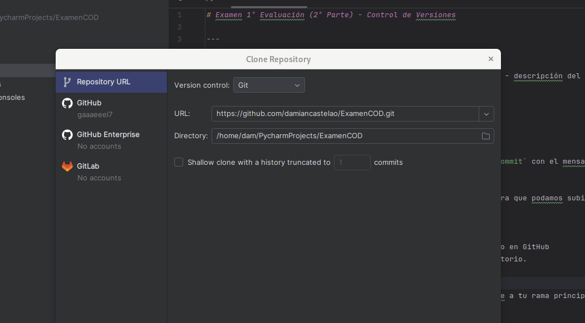
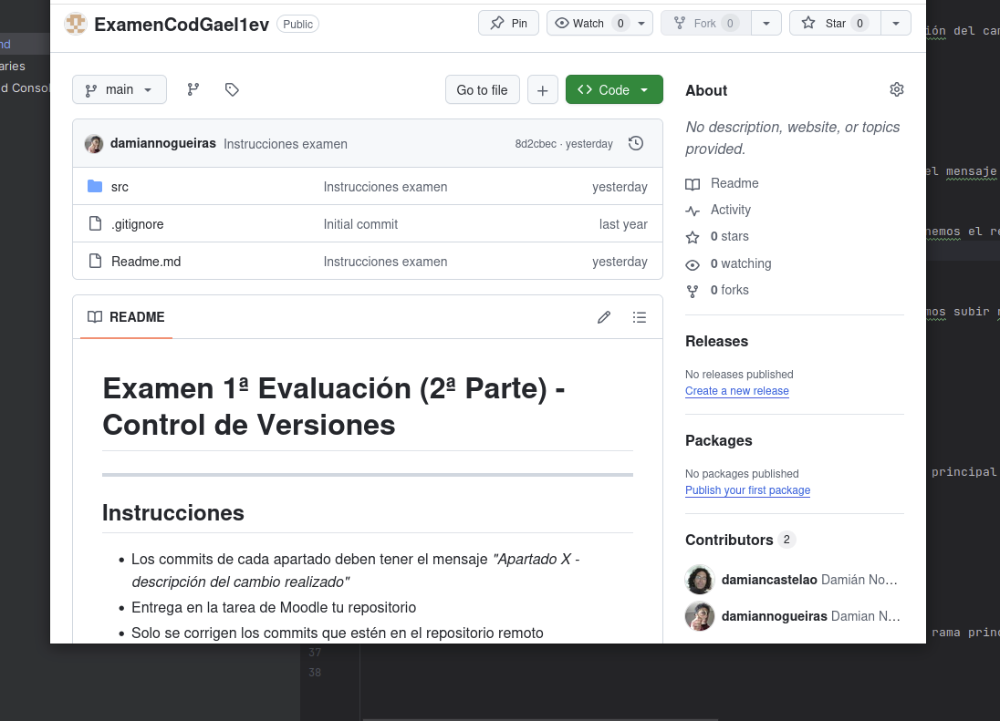
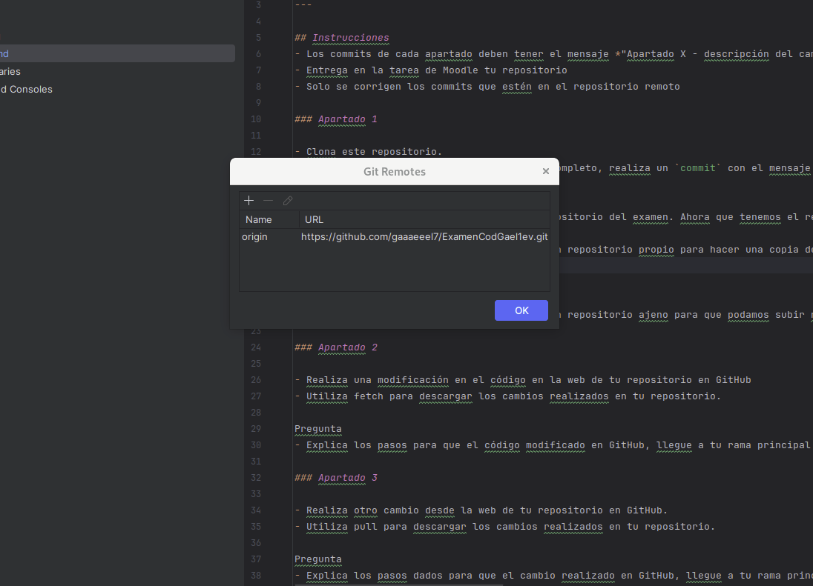
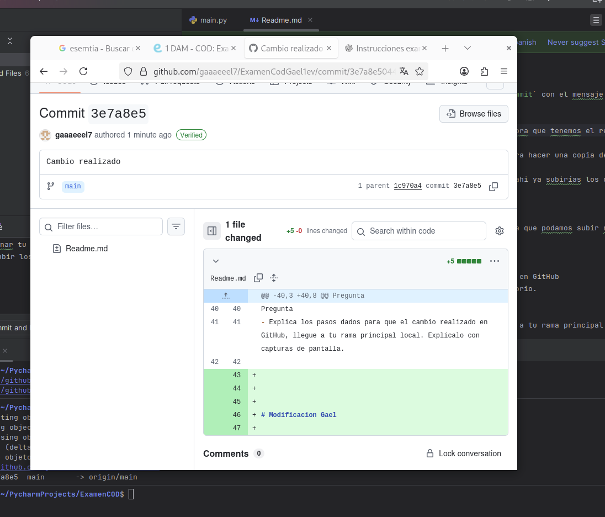
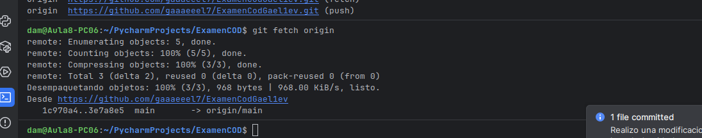
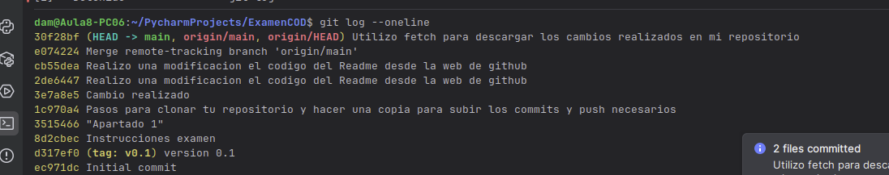
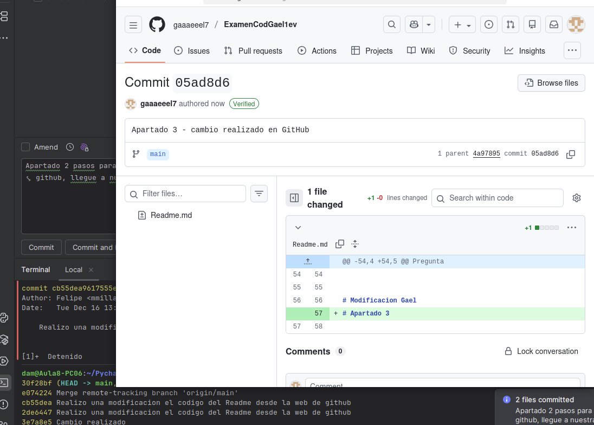
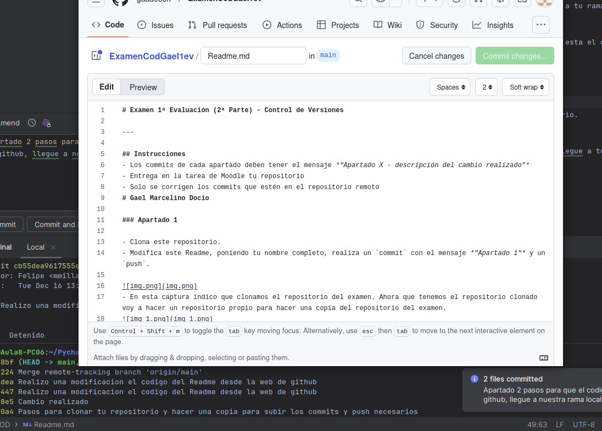
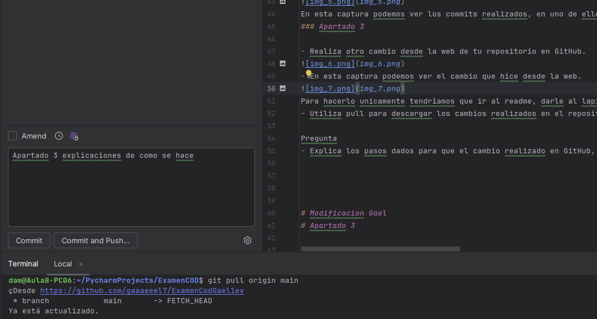
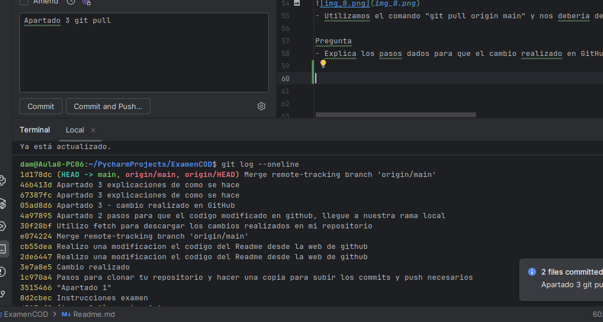

# Examen 1ª Evaluación (2ª Parte) - Control de Versiones

---

## Instrucciones
- Los commits de cada apartado deben tener el mensaje *"Apartado X - descripción del cambio realizado"*
- Entrega en la tarea de Moodle tu repositorio
- Solo se corrigen los commits que estén en el repositorio remoto
# Gael Marcelino Docio

### Apartado 1

- Clona este repositorio.
- Modifica este Readme, poniendo tu nombre completo, realiza un `commit` con el mensaje *"Apartado 1"* y un `push`.

- En esta captura indico que clonamos el repositorio del examen. Ahora que tenemos el repositorio clonado voy a hacer un repositorio propio para hacer una copia del repositorio del examen.

- En esta otra imagen podemos ver que hice un repositorio propio para hacer una copia de tu repositorio. Ahora solamente para hacer los commits y los push tendriamos que cambiar el "manage remote" desde pycharm. En la siguiente captura indicaré el "manage remote"

- Para terminar tendriamos que poner la URL de tu repositorio y de ahi ya subirías los commits y push necesarios

Pregunta 
- ¿Qué paso es fundamental cuando clonamos un repositorio ajeno para que podamos subir nuestros propios commits? Explícalo y utiliza capturas de pantalla.

### Apartado 2

- Realiza una modificación en el código en la web de tu repositorio en GitHub
- Utiliza fetch para descargar los cambios realizados en tu repositorio.

- Realizamoss un cambio desde la web al readme, llamado Modificacion Gael. Finalmente hacemos un commit, que lo he llamado cambio realizado

- Utilizo fetch para descargar los cambios realizados en mi repositorio

Pregunta
- Explica los pasos para que el código modificado en GitHub, llegue a tu rama principal local. Explícalo con capturas de pantalla.

En esta captura podemos ver los commits realizados, en uno de ellos esta el commit que hice desde github, que se llama "cambio realizado". Para comprobar que está correctamente tendriamos que poner en la terminal "git log --oneline"
### Apartado 3

- Realiza otro cambio desde la web de tu repositorio en GitHub.

- En esta captura podemos ver el cambio que hice desde la web.

Para hacerlo unicamente tendriamos que ir al readme, darle al lapiz, modificar algo y pulsar a "commit changes"
- Utiliza pull para descargar los cambios realizados en el repositorio.

- Utilizamos el comando "git pull origin main" y nos deberia de dar que esta actualizado como da en la imagen

Pregunta
- Explica los pasos dados para que el cambio realizado en GitHub, llegue a tu rama principal local. Explícalo con capturas de pantalla.

- Para finalizar con el examen, vemos que al poner el comando "git log --oneline", tenemos el cambio que hicimos desde github, que se llama Apartado 3 - cambio realizado en github

# Modificacion Gael
# Apartado 3 

